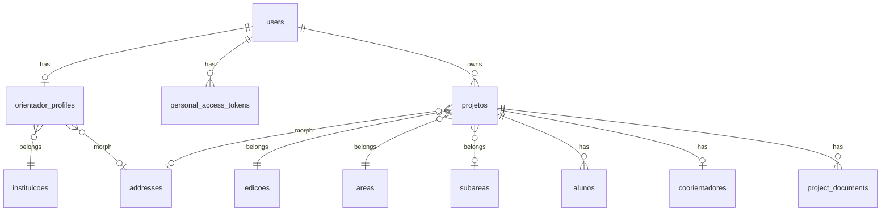

# Especificação Laravel + API — XVI FETECMS

> Documento de referência para backend **Laravel 11+** (API REST). Consumidores: **portal web** (protótipo HTML/Blade futuro) e **app mobile**.  
> O banco **não precisa replicar** o legado `SistemaInscricao`, mas os campos e regras abaixo foram derivados dele e do protótipo UI.

**Documentos relacionados:** [`BACKLOG_LARAVEL.md`](../BACKLOG_LARAVEL.md) (issues) · [`CONTEXTO_PROJETO.md`](../CONTEXTO_PROJETO.md) (front)

---

## 1. Arquitetura

```
┌─────────────┐     ┌─────────────┐
│  Web (HTML) │     │  App Mobile │
└──────┬──────┘     └──────┬──────┘
       │    HTTPS + JSON    │
       └──────────┬─────────┘
                  ▼
       ┌──────────────────────┐
       │  Laravel API (v1)    │
       │  Sanctum · Policies  │
       │  Services · Jobs     │
       └──────────┬───────────┘
                  ▼
       ┌──────────────────────┐
       │  MySQL/PostgreSQL    │
       │  Storage (S3/local)  │
       └──────────────────────┘
```

| Decisão | Escolha |
|---------|---------|
| Estilo API | REST JSON, versionada `/api/v1` |
| Auth | Laravel Sanctum (Bearer token) |
| Camada de negócio | `FormRequest` → `Controller` → `Service` → `Model` |
| Autorização | Policies por recurso (`ProjectPolicy`, etc.) |
| Upload | `Storage` + tabela `media` / `project_documents` |
| Filas | E-mail, validação vídeo pesada (opcional) |

**Repo sugerido:** `fetecms-api` (separado do front `fetecms-portal-inscricao`).

---

## 2. Padronização da API (web + app)

### 2.1 URL e versionamento

```
{BASE_URL}/api/v1/{recurso}
```

- Versão fixa no path (`v1`). Breaking change → `v2`.
- Recursos em **plural**, kebab-case: `/projetos`, `/catalogos/areas`.
- IDs numéricos (bigint) ou UUID — **recomendado: bigint** para simplicidade; expor sempre `id` no JSON.

### 2.2 Headers obrigatórios

| Header | Valor | Uso |
|--------|--------|-----|
| `Accept` | `application/json` | Sempre |
| `Content-Type` | `application/json` | Body JSON |
| `Authorization` | `Bearer {token}` | Rotas autenticadas |
| `X-Client` | `web` \| `mobile` \| `admin` | Métricas e regras opcionais |
| `Accept-Language` | `pt-BR` | Mensagens de validação |

Upload: `Content-Type: multipart/form-data` sem JSON no mesmo request (usar `_method` ou endpoint dedicado).

### 2.3 Envelope de resposta (sucesso)

```json
{
  "data": { },
  "meta": { }
}
```

**Lista paginada:**

```json
{
  "data": [ ],
  "meta": {
    "current_page": 1,
    "per_page": 15,
    "total": 42,
    "last_page": 3
  },
  "links": {
    "first": "...",
    "last": "...",
    "prev": null,
    "next": "..."
  }
}
```

**Ação sem body (delete):** `204 No Content` ou `200` com:

```json
{
  "data": { "message": "Projeto removido com sucesso." }
}
```

### 2.4 Envelope de erro

```json
{
  "message": "Os dados fornecidos são inválidos.",
  "errors": {
    "email": ["O e-mail já está em uso."],
    "cpf": ["CPF inválido."]
  },
  "code": "VALIDATION_ERROR"
}
```

| HTTP | `code` sugerido | Quando |
|------|-----------------|--------|
| 400 | `BAD_REQUEST` | Payload malformado |
| 401 | `UNAUTHENTICATED` | Token ausente/inválido |
| 403 | `FORBIDDEN` | Sem permissão (Policy) |
| 404 | `NOT_FOUND` | Recurso inexistente |
| 422 | `VALIDATION_ERROR` | FormRequest falhou |
| 409 | `CONFLICT` | Ex.: 4º aluno, projeto já submetido |
| 429 | `TOO_MANY_REQUESTS` | Rate limit |
| 500 | `SERVER_ERROR` | Erro interno (sem vazar stack em prod) |

### 2.5 Convenções REST por operação

| Ação | Método | Rota exemplo | Body |
|------|--------|--------------|------|
| Listar | `GET` | `/projetos` | Query filters |
| Detalhe | `GET` | `/projetos/{id}` | — |
| Criar | `POST` | `/projetos` | JSON |
| Atualizar total | `PUT` | `/projetos/{id}` | JSON completo |
| Atualizar parcial | `PATCH` | `/projetos/{id}` | JSON parcial |
| Remover | `DELETE` | `/projetos/{id}` | — |
| Ação de domínio | `POST` | `/projetos/{id}/submeter` | opcional |

### 2.6 Query params comuns (listagens)

| Param | Exemplo | Descrição |
|-------|---------|-----------|
| `page` | `1` | Paginação |
| `per_page` | `15` | Máx. 50 |
| `sort` | `-updated_at` | Prefixo `-` = DESC |
| `filter[status]` | `rascunho` | Filtros explícitos |
| `include` | `alunos,coorientador` | Eager load (sparse) |

### 2.7 App mobile — boas práticas na mesma API

- **Mesmos endpoints** do web; evitar rotas duplicadas `/mobile/...`.
- Listagens: usar `per_page` menor no app se necessário (15 default).
- `GET /auth/me` retorna payload enxuto + flags (`projeto_em_andamento_id`).
- Tokens: `POST /auth/login` retorna `token` + `expires_at` (se usar expiração customizada).
- Opcional P1: `POST /auth/refresh` para renovar token sem relogar.
- Imagens/arquivos: URLs assinadas temporárias em `download_url` (não path interno).
- Versionar app via header `X-App-Version` para deprecar campos no futuro.

---

## 3. Modelo de dados (novo) — referência ao legado

### 3.1 Diagrama simplificado



### 3.2 Tabelas principais

#### `users` (autenticação — substitui `login` parcialmente)

| Coluna | Tipo | Notas |
|--------|------|--------|
| id | bigint PK | |
| email | string unique | login |
| password | string | bcrypt |
| role | enum | `orientador`, `admin`, `avaliador`… |
| email_verified_at | timestamp nullable | |
| is_active | boolean default true | |
| timestamps | | |

**Legado:** `login.email`, `login.senha`, `login.tipo` (4 = orientador).

---

#### `orientador_profiles` (substitui `orientador`)

| Coluna | Tipo | Notas |
|--------|------|--------|
| id | bigint PK | |
| user_id | FK users unique | |
| nome | string | |
| cpf | string(11) unique | só dígitos |
| telefone | string | |
| data_nascimento | date | |
| genero | enum | `F`,`M`,`NB`,`O`,`P` |
| genero_outro | string nullable | se genero = O |
| camiseta | enum | PP…EXG |
| instituicao_id | FK nullable | catálogo |
| instituicao_nome | string nullable | se "outra" |
| titulacao_id | FK nullable | |
| atestado_path | string nullable | storage path |
| timestamps | | |

**Legado:** `orientador.*` + vínculo institucional.

---

#### `addresses` (polimórfico — normaliza endereço)

| Coluna | Tipo | Notas |
|--------|------|--------|
| id | bigint PK | |
| addressable_type | string | OrientadorProfile, Projeto |
| addressable_id | bigint | |
| cep | string(8) | |
| logradouro | string | |
| numero | string | |
| complemento | string nullable | |
| bairro | string | |
| cidade_id | FK nullable | |
| estado_id | FK | |
| pais_id | FK default BR | |

**Legado:** colunas espalhadas em `orientador` e `projeto` (`id_cidade`, etc.).

---

#### `edicoes` (substitui `evento` / edição FETEC)

| Coluna | Tipo | Notas |
|--------|------|--------|
| id | bigint PK | |
| nome | string | ex. XVI FETECMS |
| ano | year | 2026 |
| inscricoes_abertas | boolean | |
| inicio_em / fim_em | date nullable | |

**Legado:** `id_evento` em `projeto`.

---

#### `projetos` (substitui `projeto`)

| Coluna | Tipo | Notas |
|--------|------|--------|
| id | bigint PK | |
| user_id | FK | orientador dono |
| edicao_id | FK | |
| titulo | string | |
| instituicao | string | nome exibido |
| area_id | FK | |
| subarea_id | FK nullable | |
| resumo | text | max 2500 |
| link_video | string nullable | URL |
| link_musica | string nullable | URL |
| tempo_pesquisa_meses | unsigned smallint | |
| continuacao | boolean | |
| feira_afiliada | boolean | |
| numero_credencial_afiliada | string nullable | |
| agenda_2030 | boolean | |
| categoria_agenda_2030 | string nullable | |
| status | enum | ver abaixo |
| submitted_at | timestamp nullable | |
| timestamps / softDeletes | | |

**`status` (enum `ProjetoStatus`):**

| Valor | UI protótipo | Legado |
|-------|--------------|--------|
| `rascunho` | Rascunho | `finalizado = 0` |
| `pendente` | Pronto p/ submeter (checklist ok, não enviou) | — |
| `submetido` | Submetido | `finalizado = 1` |
| `aprovado` | — | `aprovado = 1` |
| `rejeitado` | — | futuro |

---

#### `alunos` (substitui `aluno`)

| Coluna | Tipo | Notas |
|--------|------|--------|
| id | bigint PK | |
| projeto_id | FK | |
| nome | string | |
| email | string | unique por projeto |
| cpf | string(11) | unique global recomendado |
| telefone | string | |
| data_nascimento | date | |
| genero | enum | |
| etnia | enum nullable | IBGE |
| camiseta | enum | |
| autorizacao_menor | boolean | legado `autorizacao` |
| instituicao | string nullable | |
| modalidade | string nullable | |
| ano_escolar | string nullable | |
| … | | campos extras do legado recente |
| timestamps | | |

**Regra:** máx. **3** alunos por `projeto_id` (validar no Service).

---

#### `coorientadores` (substitui `coorientador`)

| Coluna | Tipo | Notas |
|--------|------|--------|
| id | bigint PK | |
| projeto_id | FK **unique** | 1 por projeto |
| nome, email, cpf, telefone, data_nascimento, genero, camiseta | | |
| timestamps | | |

---

#### `project_documents` (substitui arquivo `projetos/PROJETO-{id}.pdf`)

| Coluna | Tipo | Notas |
|--------|------|--------|
| id | bigint PK | |
| projeto_id | FK | |
| tipo | enum | `plano_pesquisa`, `relatorio`, `anexo_geral` |
| disk, path | string | |
| nome_original | string | |
| mime | string | |
| tamanho_bytes | bigint | |
| timestamps | | |

---

#### Catálogos (seed)

`instituicoes`, `titulacoes`, `areas`, `subareas`, `paises`, `estados`, `cidades` — equivalentes às tabelas auxiliares do legado.

---

## 4. CRUDs detalhados

### 4.1 Autenticação

#### `POST /api/v1/auth/login`

**Request:**
```json
{
  "email": "orientador@escola.ms.gov.br",
  "password": "senha-segura",
  "device_name": "iPhone 15"
}
```

| Campo | Regras |
|-------|--------|
| email | required, email |
| password | required, string |
| device_name | required (Sanctum — identifica token no app) |

**Response 200:**
```json
{
  "data": {
    "token": "1|abc...",
    "token_type": "Bearer",
    "user": {
      "id": 1,
      "email": "orientador@escola.ms.gov.br",
      "role": "orientador",
      "profile": {
        "nome": "João da Silva",
        "cpf": "12345678901"
      }
    }
  }
}
```

**Service:** `AuthService::login()` — verifica `is_active`, Hash::check, cria token.

---

#### `GET /api/v1/auth/me`

**Response:** user + orientador_profile resumido + `meta.projetos_rascunho_count`.

---

#### `POST /api/v1/auth/logout`

Revoga token atual.

---

### 4.2 Registro do orientador

#### `POST /api/v1/orientadores` (registro completo — wizard 3 etapas em 1 call)

**Alternativa mobile-friendly:** `POST .../rascunho` + `PATCH .../rascunho` por etapa (P2).

**Request (exemplo consolidado):**
```json
{
  "nome": "João da Silva Santos",
  "cpf": "12345678901",
  "email": "joao@escola.ms.gov.br",
  "password": "Senha@123",
  "password_confirmation": "Senha@123",
  "telefone": "67999991234",
  "data_nascimento": "1985-03-15",
  "genero": "M",
  "camiseta": "G",
  "instituicao_id": 12,
  "titulacao_id": 2,
  "endereco": {
    "cep": "79002000",
    "logradouro": "Rua Example",
    "numero": "100",
    "bairro": "Centro",
    "cidade_id": 1,
    "estado_id": 12
  }
}
```

| Grupo | Validação |
|-------|-----------|
| Identidade | nome required max:255; cpf required, cpf único, dígitos válidos |
| Acesso | email unique:users; password min:8, confirmed |
| Acadêmico | instituicao_id exists OU instituicao_nome se outra |
| Endereço | nested `EnderecoRequest` |

**Response 201:** token + user (igual login).

**Transaction:** User → OrientadorProfile → Address → (Job upload atestado se multipart em request separado).

---

### 4.3 Perfil do orientador

| Método | Rota | Descrição |
|--------|------|-----------|
| GET | `/orientador/perfil` | Lê perfil do user autenticado |
| PUT | `/orientador/perfil` | Atualiza (exceto cpf/email ou com confirmação) |
| POST | `/orientador/atestado` | multipart — substitui atestado |

**Policy:** só `user_id` dono.

---

### 4.4 Catálogos (somente leitura)

| GET | Retorno |
|-----|---------|
| `/catalogos/edicoes` | edições abertas |
| `/catalogos/instituicoes?search=` | autocomplete |
| `/catalogos/areas` | |
| `/catalogos/subareas?area_id=` | |
| `/catalogos/estados` | |
| `/catalogos/cidades?estado_id=` | |
| `/cep/{cep}` | proxy ViaCEP normalizado |

**Cache:** `Cache::remember` 1h em catálogos estáveis.

---

### 4.5 Projetos — CRUD completo

#### `GET /api/v1/projetos`

**Query:** `filter[status]=rascunho|submetido|pendente`, `sort=-updated_at`

**Resource `ProjetoListResource`:**
```json
{
  "id": 1,
  "titulo": "Bioplástico...",
  "instituicao": "EE Prof. João Mendes",
  "status": "submetido",
  "updated_at": "2026-05-12T14:30:00-04:00",
  "integrantes_resumo": {
    "alunos_count": 2,
    "alunos_max": 3,
    "tem_coorientador": true
  },
  "pendencias_count": 0
}
```

**Service:** `ProjetoService::listarPorOrientador($user)` — calcula pendências via `ProjetoChecklistService`.

---

#### `POST /api/v1/projetos`

**Request mínimo:**
```json
{
  "edicao_id": 1,
  "titulo": "Novo projeto"
}
```

Cria `status = rascunho`, `user_id` = auth.

**Response 201:** `ProjetoResource` completo.

---

#### `GET /api/v1/projetos/{id}`

**Include:** `?include=alunos,coorientador,documents,address`

**Policy:** `view` — dono ou admin.

---

#### `PATCH /api/v1/projetos/{id}`

**Request (campos opcionais — partial):**
```json
{
  "titulo": "string",
  "area_id": 1,
  "subarea_id": 2,
  "instituicao": "string",
  "resumo": "text max:2500",
  "link_video": "url",
  "link_musica": "url",
  "tempo_pesquisa_meses": 6,
  "continuacao": true,
  "feira_afiliada": false,
  "agenda_2030": true,
  "categoria_agenda_2030": "ODS 6",
  "endereco": { }
}
```

| Regra | Implementação |
|-------|----------------|
| Só edita se `status` in (`rascunho`, `pendente`) | `ProjetoPolicy::update` |
| `resumo` max 2500 | validation |
| `link_video` | salvar + opcional validar via `VideoValidationService` |

**Service:** `ProjetoService::atualizar($projeto, $dto)`.

---

#### `DELETE /api/v1/projetos/{id}`

- Apenas `rascunho`.
- Cascade: alunos, coorientador, documents (apagar arquivos storage).

---

#### `POST /api/v1/projetos/{id}/validar-video`

**Request:** `{ "url": "https://youtube.com/..." }`  
**Response:** `{ "valid": true, "provider": "youtube", "embed_url": "...", "title": "..." }`

---

### 4.6 Integrantes — visão agregada

#### `GET /api/v1/projetos/{id}/integrantes`

**Protótipo:** `integrantes.html`

```json
{
  "data": {
    "orientador": { "nome": "...", "email": "..." },
    "alunos": [ ],
    "coorientador": null,
    "limites": { "alunos_max": 3, "alunos_atual": 2 }
  }
}
```

---

### 4.7 Alunos — CRUD

| Método | Rota | Status |
|--------|------|--------|
| GET | `/projetos/{projeto}/alunos` | Lista |
| POST | `/projetos/{projeto}/alunos` | Cria |
| GET | `/projetos/{projeto}/alunos/{id}` | Detalhe |
| PUT | `/projetos/{projeto}/alunos/{id}` | Atualiza |
| DELETE | `/projetos/{projeto}/alunos/{id}` | Remove |

**POST — Request:**
```json
{
  "nome": "Maria Clara Ferreira",
  "email": "maria@aluno.ms.gov.br",
  "cpf": "11122233344",
  "telefone": "67988887777",
  "data_nascimento": "2008-05-20",
  "genero": "F",
  "etnia": "parda",
  "camiseta": "M",
  "autorizacao_menor": true
}
```

| Validação | Detalhe |
|-----------|---------|
| projeto editável | Policy |
| count alunos < 3 | `AlunoService::podeAdicionar()` → 409 |
| cpf | único, válido |
| email | unique em `alunos` where projeto_id |

**Response 201:** `AlunoResource`.

**Side effects (P2):** Job `EnviarEmailAlunoJob` com token primeiro acesso.

---

### 4.8 Coorientador — upsert (não é lista — máx. 1)

| Método | Rota | Descrição |
|--------|------|-----------|
| GET | `/projetos/{id}/coorientador` | Retorna objeto ou `null` |
| PUT | `/projetos/{id}/coorientador` | Cria ou substitui |
| DELETE | `/projetos/{id}/coorientador` | Remove |

**PUT — Request:** mesmo shape do aluno (sem campos escolares).

**Regra:** `projeto_id` unique em `coorientadores`.

---

### 4.9 Documentos do projeto

| Método | Rota | Descrição |
|--------|------|-----------|
| GET | `/projetos/{id}/documentos` | Lista metadados |
| POST | `/projetos/{id}/documentos` | multipart `file`, `tipo` |
| GET | `/projetos/{id}/documentos/{docId}/download` | URL assinada 15min |
| DELETE | `/projetos/{id}/documentos/{docId}` | Remove |

**POST validação:**

| Regra | Valor |
|-------|--------|
| mime | pdf, docx |
| max | 10 MB (10240 KB) |
| tipos | enum |

**Legado:** arquivo obrigatório `PROJETO-{id}.pdf` na submissão — mapear para `tipo = plano_pesquisa` obrigatório.

---

### 4.10 Resumo e submissão

#### `GET /api/v1/projetos/{id}/resumo`

**Protótipo:** `cadastro7.html`

```json
{
  "data": {
    "projeto": { },
    "integrantes": { },
    "checklist": {
      "titulo_preenchido": true,
      "resumo_preenchido": true,
      "link_video_valido": true,
      "arquivo_plano_anexado": true,
      "minimo_alunos": true,
      "coorientador_opcional_ok": true
    },
    "pendencias": [
      { "code": "VIDEO_AUSENTE", "message": "Link do vídeo está em branco." }
    ],
    "pode_submeter": false
  }
}
```

**Service:** `ProjetoChecklistService::avaliar($projeto)` — espelha `submeter-projeto.php`.

---

#### `POST /api/v1/projetos/{id}/submeter`

**Request:** vazio ou `{ "confirmar": true }`

**Fluxo:**
1. Policy `submit` — só dono.
2. `ProjetoChecklistService` — se pendências → 422 + lista.
3. DB transaction: `status = submetido`, `submitted_at = now()`.
4. Event `ProjetoSubmetido` → notificação e-mail (Job).

**Response 200:**
```json
{
  "data": {
    "id": 1,
    "status": "submetido",
    "submitted_at": "2026-05-17T22:00:00-04:00",
    "message": "Inscrição submetida com sucesso."
  }
}
```

**Idempotência:** se já `submetido`, retornar 200 com mensagem (não erro).

---

## 5. Camada Laravel — padronização de código

### 5.1 Estrutura de classes por recurso

```
app/
├── Enums/ProjetoStatus.php
├── Models/Projeto.php
├── Http/
│   ├── Controllers/Api/V1/ProjetoController.php
│   ├── Requests/Projeto/StoreProjetoRequest.php
│   ├── Requests/Projeto/UpdateProjetoRequest.php
│   └── Resources/ProjetoResource.php
├── Services/ProjetoService.php
├── Services/ProjetoChecklistService.php
├── Policies/ProjetoPolicy.php
└── Observers/ProjetoObserver.php (opcional)
```

### 5.2 Controller (padrão)

```php
// thin controller
public function update(UpdateProjetoRequest $request, Projeto $projeto)
{
    $this->authorize('update', $projeto);
    $data = $this->projetoService->atualizar($projeto, $request->validated());
    return new ProjetoResource($data);
}
```

### 5.3 FormRequest

- Mensagens em `pt_BR` via `lang/pt_BR/validation.php`.
- `prepareForValidation()` para limpar CPF/telefone (só números).

### 5.4 API Resources

- `ProjetoResource`, `ProjetoListResource`, `AlunoResource` — nunca retornar path interno de arquivo.
- Dates em ISO 8601 com timezone `America/Campo_Grande`.

### 5.5 Policies (matriz)

| Recurso | view | create | update | delete | submit |
|---------|------|--------|--------|--------|--------|
| Projeto | dono, admin | orientador | dono + rascunho | dono + rascunho | dono |
| Aluno | dono do projeto | dono | dono | dono | — |

### 5.6 DTOs (opcional P1)

`App\Data\ProjetoData` com Spatie Laravel Data para tipar entrada do Service.

---

## 6. Mapeamento legado → novo (migração)

| Legado | Novo | Observação |
|--------|------|------------|
| `login` + `orientador` | `users` + `orientador_profiles` | unificar auth |
| `projeto.id_orientador` | `projetos.user_id` | |
| `projeto.finalizado` | `projetos.status = submetido` | |
| `projeto.id_evento` | `projetos.edicao_id` | |
| `aluno.id_projeto` | `alunos.projeto_id` | |
| `coorientador.id_projeto` | `coorientadores.projeto_id` unique | |
| arquivo `projetos/PROJETO-x.pdf` | `project_documents` + Storage | |
| `hash_aluno` | tabela `aluno_access_tokens` (P2) | primeiro acesso aluno |

---

## 7. Rotas `routes/api.php` (resumo)

```php
Route::prefix('v1')->group(function () {
    Route::get('/health', fn () => response()->json(['status' => 'ok']));

    Route::post('/auth/login', [AuthController::class, 'login']);
    Route::post('/orientadores', [OrientadorController::class, 'store']);

    Route::middleware('auth:sanctum')->group(function () {
        Route::post('/auth/logout', [AuthController::class, 'logout']);
        Route::get('/auth/me', [AuthController::class, 'me']);

        Route::apiResource('projetos', ProjetoController::class);
        Route::get('projetos/{projeto}/integrantes', [IntegranteController::class, 'index']);
        Route::get('projetos/{projeto}/resumo', [ProjetoSubmissaoController::class, 'resumo']);
        Route::post('projetos/{projeto}/submeter', [ProjetoSubmissaoController::class, 'submeter']);
        Route::post('projetos/{projeto}/validar-video', [ProjetoController::class, 'validarVideo']);

        Route::apiResource('projetos.alunos', AlunoController::class)->shallow();
        Route::put('projetos/{projeto}/coorientador', [CoorientadorController::class, 'upsert']);
        Route::delete('projetos/{projeto}/coorientador', [CoorientadorController::class, 'destroy']);
        Route::apiResource('projetos.documentos', DocumentoController::class)->shallow();

        Route::prefix('catalogos')->group(...);
        Route::get('/cep/{cep}', [CepController::class, 'show']);
    });
});
```

---

## 8. Checklist de submissão (regra de negócio centralizada)

Implementar em `ProjetoChecklistService`:

| # | Código | Condição |
|---|--------|----------|
| 1 | `TITULO_OBRIGATORIO` | titulo não vazio |
| 2 | `RESUMO_OBRIGATORIO` | resumo não vazio |
| 3 | `VIDEO_OBRIGATORIO` | link_video preenchido e válido |
| 4 | `MUSICA_OBRIGATORIA` | link_musica preenchido |
| 5 | `EDICAO_OBRIGATORIA` | edicao_id |
| 6 | `AREA_OBRIGATORIA` | area_id |
| 7 | `INSTITUICAO_OBRIGATORIA` | instituicao |
| 8 | `LOCALIZACAO_OBRIGATORIA` | endereço país/estado/cidade |
| 9 | `ARQUIVO_PLANO_OBRIGATORIO` | documento tipo plano_pesquisa |
| 10 | `MINIMO_UM_ALUNO` | alunos count >= 1 |

Retornar array de `pendencias` com `code` + `message` para UI web e app exibirem igual.

---

## 9. Issues do backlog vinculadas

Cada issue `FETEC-0xx` em [`BACKLOG_LARAVEL.md`](../BACKLOG_LARAVEL.md) deve linkar para a seção deste doc:

| Issue | Seção |
|-------|--------|
| FETEC-010–014 | §4.2, §4.3 |
| FETEC-020–022 | §4.4 |
| FETEC-030–035 | §4.5 |
| FETEC-040–044 | §4.6–4.8 |
| FETEC-050–053 | §4.9 |
| FETEC-060–061 | §4.10, §8 |

---

*Última atualização: maio/2026*
